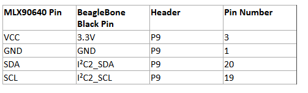

# MLX90640 OPC UA Thermal Server

This project sets up an **OPC UA server** to stream thermal data from an **MLX90640 infrared camera** over I�C. The server runs on a **BeagleBone, Raspberry Pi, or any Linux-based SBC** and allows clients to retrieve thermal data in real-time.

---

## **1. Prerequisites**

Ensure you have Python **3.8+** installed. Install dependencies with:

```
pip install adafruit-circuitpython-mlx90640 asyncua numpy
```

For **Linux-based system (BeagleBone)**, install additional I�C dependencies:

```
sudo apt update && sudo apt install -y python3-smbus i2c-tools
```

Give permissions on **Beaglebone** boot
```
sudo chmod 666 /sys/bus/nvmem/devices/0-00501/nvmem
```

---

## **2. Enable I�C (For Raspberry Pi & BeagleBone)**

### **Check if I�C is enabled**
```
ls /dev/i2c-*
```
If no `/dev/i2c-*` devices appear, enable I�C:

### **For BeagleBone:**
```
sudo config-pin P9.19 i2c
sudo config-pin P9.20 i2c
```

---

## **3. Connect the MLX90640 Sensor**



Check if the sensor is detected:
```
i2cdetect -y 2  # BeagleBone
```
You should see a device at address **0x33**.

---

## **4. Running the OPC UA Server**

Once the dependencies are installed and the sensor is connected, run the script:

```
python server_sensor_data_opcua.py
```
*(Replace `script.py` with your actual filename.)*

The OPC UA server will start at:
```
opc.tcp://0.0.0.0:4840/freeopcua/server/
```

When thermal frames starts to get fetched it prints:
```
Updated OPC UA node with new thermal data
```

---

## **5. Accessing the OPC UA Server**

### **Start the client code**
On the client directory follow the install instructions and start the client app.


---
